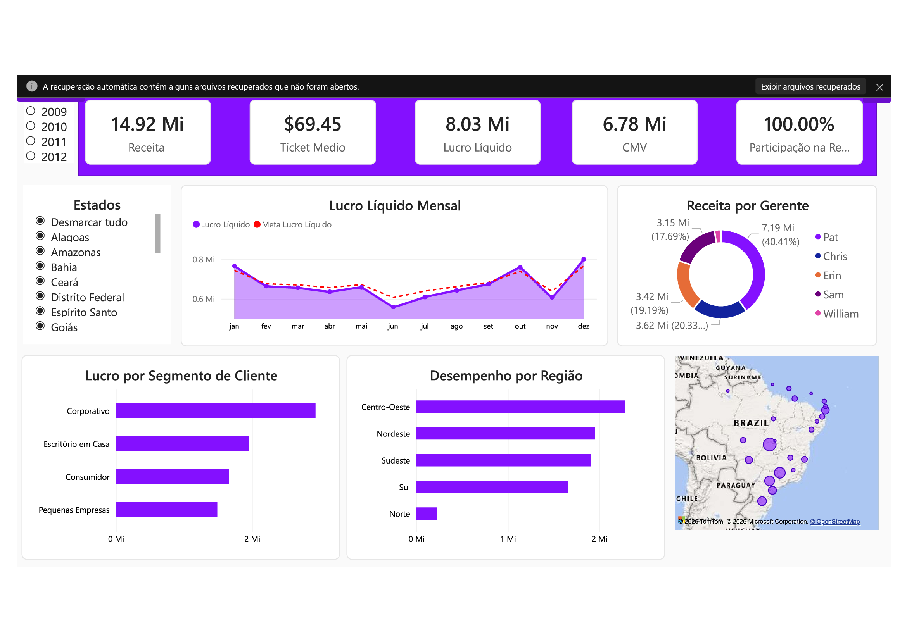

# 📊 Dashboard de Análise de Vendas — Power BI

> Painel interativo de inteligência comercial com análise de receita, lucro, desempenho por região, segmento de cliente e gerentes de vendas.

---

## 🖼️ Preview do Dashboard

  ⭐ Se este projeto te ajudou, deixa uma estrela no repositório!

---

## 🎯 Objetivo do Projeto

Este projeto tem como finalidade construir uma **visão analítica completa do desempenho comercial**, permitindo que gestores e analistas tomem decisões baseadas em dados com agilidade e precisão.

O dashboard responde a perguntas estratégicas como:

- Qual foi a **receita líquida** e o **lucro líquido** no período?  
- Quais **regiões e estados** geram mais resultado?  
- Qual o desempenho por **segmento de cliente**?  
- Como está a performance de cada **gerente de vendas**?  
- O lucro está acima ou abaixo da **meta**?  
- Qual é o **ticket médio** das vendas?  

---

## 🗂️ Estrutura do Relatório

O arquivo `.pbix` contém **3 páginas**:

| Página | Descrição |
|--------|-----------|
| `Página 1` | Painel principal com todos os KPIs e visualizações |
| `Página 2` | Rascunho / dados auxiliares (oculta no modo de visualização) |
| `Duplicata de Página 1` | Variação do painel principal para análise comparativa |

---

## 📈 Visuais e Indicadores

### 🔢 KPIs (Cards de Resumo)

| Indicador | Descrição |
|-----------|-----------|
| **Receita Líquida** | Total de vendas após deduções |
| **Lucro Líquido** | Resultado após custos e despesas |
| **CMV** | Custo das Mercadorias Vendidas |
| **Ticket Médio** | Valor médio por venda |
| **% Participação Receita** | Share de receita no ranking de segmentos |

### 📊 Gráficos e Mapas

| Visual | Tipo | Dimensão Analisada |
|--------|------|-------------------|
| Lucro por Região | Barras Horizontais | Região |
| Lucro por Segmento de Cliente | Barras Horizontais | Segmento do Cliente |
| Evolução do Lucro vs. Meta | Linhas | Mês / Ano |
| Receita por Gerente | Rosca (Donut) | Gerente |
| Mapa Geográfico de Vendas | Mapa Interativo | Estado |

### 🎛️ Filtros (Slicers)

- **Ano** — filtra todo o relatório por período anual  
- **Estado** — filtra por unidade federativa  

---

## 🧱 Modelo de Dados

O modelo segue o padrão **Star Schema** com as seguintes tabelas identificadas:

